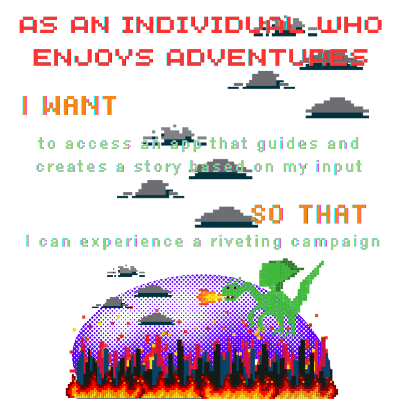
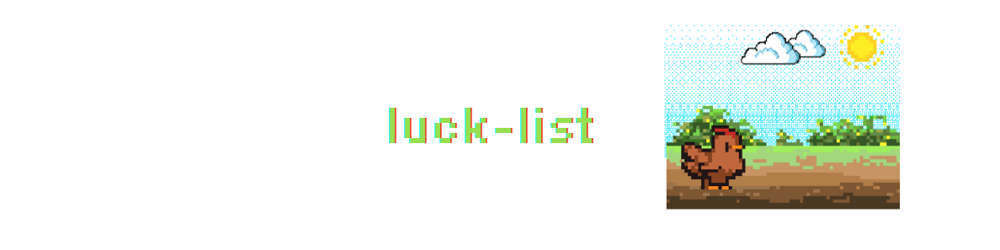

 

 
 

 

### 

  - [OVERVIEW](#overview)
    - [*user story*](#user-story)
    - [*concept design*](#concept-design)
    - [*luck list*](#luck-list)
    - [*the adventure team*](#team)
  - [INSTALLATION](#installation)
  - [USAGE](#usage)
    - [*screenshot*](#screenshot)
    - [*demo*](#demo)
  - [TESTING](#testing)
  - [SOURCES](#sources)
  - [LICENSE](#license)
  - [LINKS](#links)
  - [CONNECT](#connect)

### 

`STROKE OF LUCK` is an interactive **Choose Your Own Adventure (CYOA)** game where adventurers partake on a journey, guided by chance. The app follows the MVC paradigm in its architectural structure, using [Handlebars.js](https://handlebarsjs.com/) as the templating language,[Sequelize](https://www.npmjs.com/package/sequelize) as the ORM, the [express-session](https://www.npmjs.com/package/express-session) npm package for authentication, and [Heroku](https://www.heroku.com/), the platform hosting the application.

* [express-handlebars](https://www.npmjs.com/package/express-handlebars) package to implement [Handlebars.js]() for *views*.

* [MySQL2](https://www.npmjs.com/package/mysql2) and [Sequelize](https://www.npmjs.com/package/sequelize) packages to connect  to `STROKE OF LUCK's` **database** for *models*

* [Express.js](https://expressjs.com/) API for *controllers*.

* [dotenv](https://www.npmjs.com/package/dotenv) package to use environment variables to **store sensitive data**, [bcrypt package](https://www.npmjs.com/package/bcrypt) to **hash passwords**, & [express-session](https://www.npmjs.com/package/express-session) and  [connect-session-sequelize](https://www.npmjs.com/package/connect-session-sequelize) packages to add **authentication**.

#
>The [express-session](https://www.npmjs.com/package/express-session) package stores the session data on the client in a cookie - when an adventurer is idle on `STROKE OF LUCK` for more than a set time, the cookie will expire and the adventurer will be required to log in again to start a new session.
#

### 
<!-- 

  

 -->

### 
<!-- 

  

 -->

### 
<!-- 

  

 -->

<!-- ###  -->
<!-- 

  

 -->

#